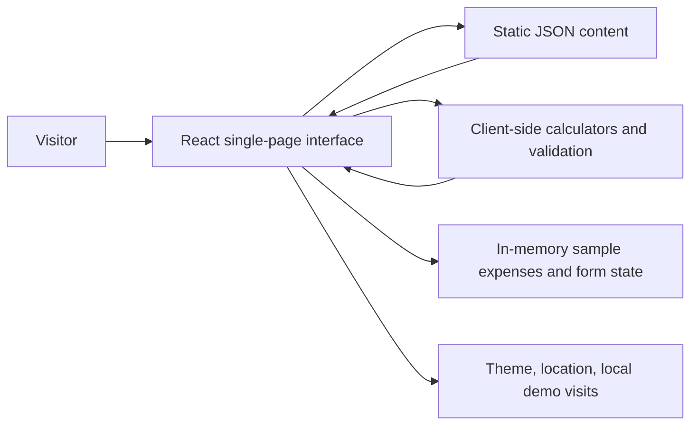
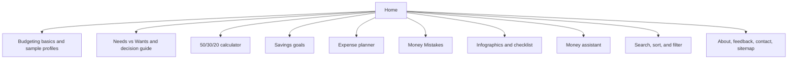

# BudgetBasics Project Report

## 1. Project overview

BudgetBasics is a responsive, single-page educational website for students and beginners learning to plan a budget. It explains income, expenses, needs, wants, and saving; lets visitors try sample calculations; and provides practical budgeting guidance without connecting to a bank or storing financial records on a server.

The project addresses a common student problem: small purchases, irregular income, and unclear priorities can make it difficult to plan for essential bills and savings. BudgetBasics presents short explanations, examples, a sample student budget, interactive exercises, and a printable monthly checklist.

### Project details

- **Project title:** BudgetBasics
- **Theme:** NextGen BudgetBee
- **Category:** Web Innovation Unleashed
- **Platform:** Responsive client-side single-page website
- **Version:** 1.0.0

## 2. Scope and constraints

- The application runs in a browser as a client-side React single-page app.
- Pre-populated content and sample data are stored as JSON files.
- Expense rows and form values are demonstrations held in browser memory; form submissions are validated and confirmed locally but are not transmitted or saved.
- Theme, location, and the demo visitor counter use browser storage. The visitor counter is local to a browser, not a shared analytics count.
- Calculations are educational estimates, not financial advice or banking services.

## 3. User interface and navigation

The header contains the BudgetBasics brand and tagline, responsive links to the learning modules, a theme control, local visit count, date/time, currency/location control, and a budgeting tip ticker. The page includes direct links to budgeting basics, Needs vs Wants, the 50/30/20 calculator, savings goals, expense planning, Money Mistakes, infographics, the chatbot, feedback, contact, and About. The footer contains module links and the sitemap.

The page adapts its card grids and navigation for desktop, tablet, and mobile widths. Keyboard focus indicators, labeled controls, descriptive image alternatives, and an accessible expandable menu are provided in the interface. Browser compatibility, Lighthouse scores, and WCAG conformance still require manual evaluation on the target devices.

## 4. Functional requirements mapping

| SRS module | Implementation in BudgetBasics |
|---|---|
| Landing and navigation | Brand, tagline, welcome banner, calls to action, featured tips, quick facts, local demo visitor counter, date/time, currency/location selector, ticker, sitemap, and module links. |
| Budgeting basics | Income and expense concept cards, sample student profiles with itemized income and allocations, and an interactive knowledge check. |
| Needs vs Wants | Examples, user classification controls, immediate feedback, a rotating sample challenge, and a decision guide that prompts a 24-hour pause for non-essential purchases. |
| 50/30/20 budget | Validated income input, calculated amounts and percentages, progress indicators, clear labels, and an educational note explaining that the split is adjustable. |
| Savings goals | Goal name, target, current savings, and monthly contribution inputs; validation; remaining amount and estimated time; progress indicator; and a savings tip. |
| Expense planner | Add, edit, and delete session entries with date, category, description, and amount; total and remaining sample balance; CSV export. |
| Money Mistakes | Expandable scenarios and corrective actions for common student spending mistakes. |
| Infographics and learning gallery | Four original, responsive visual explainers with captions, alternative text, topic filters, and a print/save-as-PDF monthly checklist. |
| Chatbot assistant | Question input, suggested prompts, keyword-matched prewritten answers, a safe fallback, and an educational disclaimer. It is a rule-based helper, not a generative AI service. |
| Search, sort, and filter | Search over learning/resource text, category filter, title/topic sorting, topic-filtered infographic gallery, and no-results feedback. |
| About, feedback, and contact | About-purpose text; validated client-side feedback/contact forms with confirmation; displayed email and phone. Creator names and social profiles must be supplied from project-owned details before submission. |
| Additional features | Responsive mobile menu, active/hover/focus states, dark mode, animated cards, smooth section scrolling, quote/tip ticker, back-to-top control, and footer navigation. |

## 5. Architecture and information flow

## 6. Development and operating requirements

The SRS lists a minimum Intel Core i5/i7-class processor, 8 GB memory, color SVGA display, 500 GB storage, mouse and keyboard, and an internet connection for optional external resources and browser testing. The application itself runs locally without a backend service.

| Area | Project configuration |
|---|---|
| Runtime and build | Node.js 20.19+ or 22.12+, npm, and Vite |
| Front end | React, JavaScript ES modules, and CSS |
| Content data | JSON files under `data/` |
| Browser state | In-memory session values; local storage for theme, location, and local demo visit count |
| Development editor | Any editor that supports JavaScript/React and CSS; no specific IDE is required |

## 7. Calculation and validation rules

- 50/30/20 amounts are monthly income multiplied by each configured percentage.
- Savings remaining is `max(0, target - current savings)`; required months are the ceiling of remaining divided by the monthly contribution. A funded goal returns zero months.
- Expense total is the sum of current session rows. Remaining sample balance is the configured monthly sample income minus that total and may become negative when expenses exceed it.
- Empty, invalid, zero, negative, and out-of-range values are rejected where the corresponding field requires a positive or non-negative number. Browser-native required, email, and numeric constraints complement application checks.

## 8. Non-functional requirements

| Attribute | Design/implementation response | Verification status |
|---|---|---|
| Safety and privacy | No banking access, server submission, or automatic downloads; CSV export is user initiated. Local demo values are disclosed in the README. | Source-reviewed; hosting behavior not independently audited. |
| Accessibility | Semantic sections, labels, alternative text, keyboard focus styling, expandable content, and accessible names are present. | Needs keyboard and screen-reader review. |
| User friendliness | Plain-language copy, consistent controls, immediate calculation and form feedback. | Needs user review. |
| Operability and reliability | Client-side calculations, validation, session ledger, search, and controls are implemented. | Production build succeeds; interactive scenarios remain to be manually run. |
| Performance | Static JSON and local assets; Vite production build. | Build output generated; Lighthouse not run. |
| Scalability and maintainability | Content is separated into JSON; app uses React state and responsive CSS. | Source structure reviewed. |
| Compatibility | Responsive CSS and browser-native controls. | Chrome, Firefox, Edge, Safari, tablet, and mobile testing remain outstanding. |
| Accuracy of educational output | Explicit percentages and formulas; adjustable-guideline and educational disclaimers. | Formula scenarios are listed in `test-cases.md`; not marked as executed. |

## 9. Manual test data and validation scenarios

The manual validation scenarios, inputs, and expected outcomes are in [`test-cases.md`](test-cases.md). They are a test plan, not a record of tests already run.

## 10. Installation

See the root [`README.md`](../README.md) for prerequisites, local development commands, and production preview instructions.

## 11. AI use acknowledgement

OpenAI Codex was used as a coding and documentation assistant during this implementation. The project team should review the changes, validate the calculations and content, and be able to explain the submitted design and code. Any additional AI tools used by the team should also be acknowledged accurately.

## 12. Submission checklist

- [x] Application source and static JSON content
- [x] Project report with architecture diagrams and requirement mapping
- [x] Installation guide
- [x] Manual validation scenarios and sample values
- [x] Printable student budget checklist
- [ ] Replace sample creator names and social URL placeholders with real project details
- [ ] Run the manual validation scenarios and record actual results
- [ ] Record the mandatory MP4 demonstration video and include it in the submission archive
